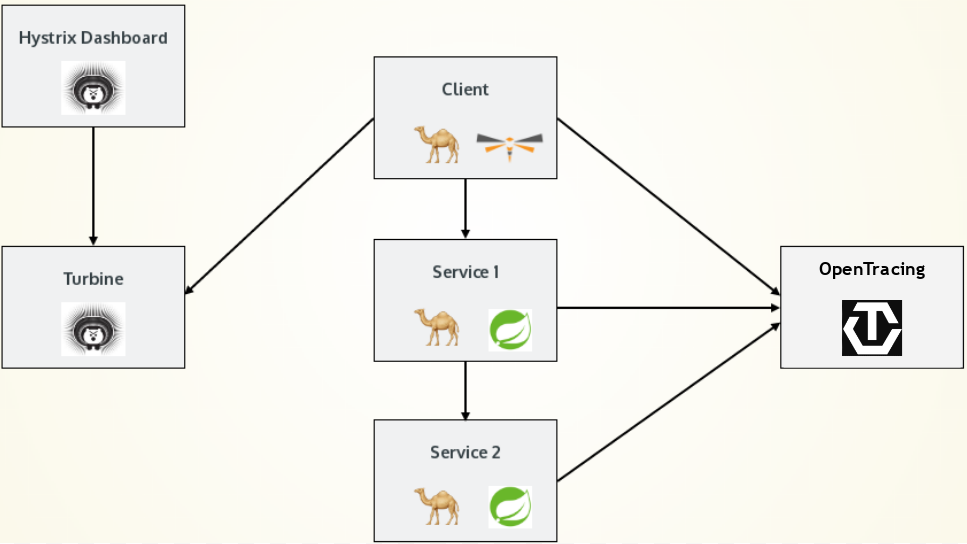

# Camel Microservice Demo

A small set of [Apache Camel](http://camel.apache.org) Microservice applications, used for the basis of my [London JBug presentation](http://www.meetup.com/JBoss-User-Group/events/234803660/).

Demonstrates running two different flavours of Camel Microservice on [Kubernetes](http://kubernetes.io/) and [OpenShift](https://www.openshift.com/):

* Camel with [Spring Boot](https://projects.spring.io/spring-boot/)
* Camel with [Throntail](https://thorntail.io/)
* [Hystirx](https://github.com/Netflix/Hystrix)
* [Zipkin](http://zipkin.io/)

The demo is composed of 3 Microservices. The overall aim is to generate a name that is made up of a
title, first name and last name.

#### 1. The client service

The client selects a random first name and HTTP POSTs this to the second service

#### 2. The name prefix service

The prefix service selects a random title and prepends this to the name sent from the client service. The modified name is then HTTP POSTed to the third service.

#### 3. The name suffix service

The suffix service selects a random last name and a random noun word. This is appended to the name
received from the prefix service.

[Minikube](https://github.com/kubernetes/minikube) and [Minishift](https://github.com/jimmidyson/minishift) was used as a simple means of running a local development cluster.

## Deploying to a cluster

The example applications can be deployed to either a Kubernetes or OpenShift cluster. For simplicity, [Minikube](https://github.com/kubernetes/minikube) or [Minishift](https://github.com/jimmidyson/minishift) are useful for running a local cluster.

> __Note:__ For brevity, kubectl is used as the cluster client command. If you're using OpenShift,
substitue kubectl for oc.

To deploy OpenTracing and Hystrix servers run:

    kubectl create -f deployment-kubernetes.yml

For OpenShift run:

    oc create -f deployment-openshift.yml

Depending on the speed of your connection it may take a while for the images to be pulled. You
can check progress by examining the pod status:

    kubectl get pod

    NAME                                 READY     STATUS    RESTARTS   AGE
    hystrix-dashboard-4190263026-0tou6   1/1       Running   0          37s
    turbine-server-56523232-eio5i        1/1       Running   0          37s

Once everything is up and running, we can connect to the Hystrix dashboard via its [NodePort](http://kubernetes.io/docs/user-guide/services/#type-nodeport) address:

    kubectl get service

    NAME                CLUSTER-IP   EXTERNAL-IP   PORT(S)   AGE
    hystrix-dashboard   10.0.0.90    <nodes>       80/TCP    1m
    turbine-server      10.0.0.115   <nodes>       80/TCP    1m

    kubectl describe service hystrix-dashboard

    Name:			  hystrix-dashboard
    Namespace:	     default
    Type:			  NodePort
    IP:			    10.0.0.90
    Port:			  <unset>	80/TCP
    NodePort:		  <unset>	31137/TCP
    Endpoints:	     172.17.0.3:8080

In the above example you would browse to [http://your-cluster-ip:31137]() and the Hystrix Dashboard should be displayed. You can accept the default URL of [http://turbine-server/turbine.stream]() and click the 'Monitor Stream' button.

Initially you'll be presented with nothing more than a 'Loading...' message, because there are
no deployed applications emitting Hystrix events.

Once the OpenTracing pod is up and running you can access the web UI by using the method outlined above for finding the OpenTracing service NodePort.

For OpenShift you can use the route URL to access the services. You can view the service URLs by running:

    oc get route opentracing hystrix-dashboard

### Deploy sample applications

If you're using Minikube or Minishift, it makes sense to use the Docker daemon of the VM rather than the one on your host:

    eval $(minikube docker-env)

Otherwise the images built by the Maven build will need pushing to Docker Hub or another registry.

To build and deploy each application to the cluster do:

    mvn fabric8:deploy

When each pod has successfully started you can change into the `name-service-client` directory and tail the pod log:

    cd name-service-client
    mvn fabric8:log

You should start to see random names being output to the console every 10 seconds.

#### Changing the name generation period

By default, names are generated every 10 seconds. To change this do:

    kubectl edit configmap client-service-config

Then modify the `timer.period` property. Saving the changes will reflect immediately in the running application.

## Running locally

The simplest way to run the project locally is with [docker-compose](https://docs.docker.com/compose/).

Make sure you have built the project docker images locally by running:

    mvn clean install

Then start the services:

    docker compose up

You should see some humorous names being output to the console. HTTP traces can be monitored in the Jaeger UI at [http://localhost:16686](http://localhost:16686).

### Cleaning up

You can tear down all of the deployed project objects by:

    mvn fabric8:undeploy
